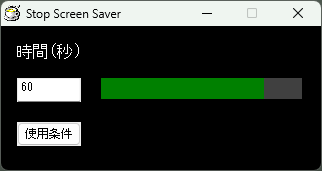

# Stop Screen Saver

## 開発ツール

Hot Soup Processor

 [プログラミング言語 HSP3 公式 - HSPTV! (公式サイト)](http://hsp.tv/)

## 概要

このソフトは、スクリーンセーバーの起動を防止することを目的としています。

指定された時間内にマウスカーソルの座標が変わらなかった、このソフトはマウスカーソルを微動させます。

- カーソル微動について
  - x方向に+10移動させた後、即座にx方向に-10移動させます。
- 座標確認の間隔は約1秒です。
- 処理の詳細は、同梱されたソースファイルでご確認ください。

## 使用条件

セキュリティ面などを考慮し、ユーザの責任においてご利用ください。

同意いただけない場合、ソフトを終了してください。

## 実行ファイル

- [version 1.0.0.0](Arcives/StopScreenSaver_bin_v1.0.0.0.zip)
